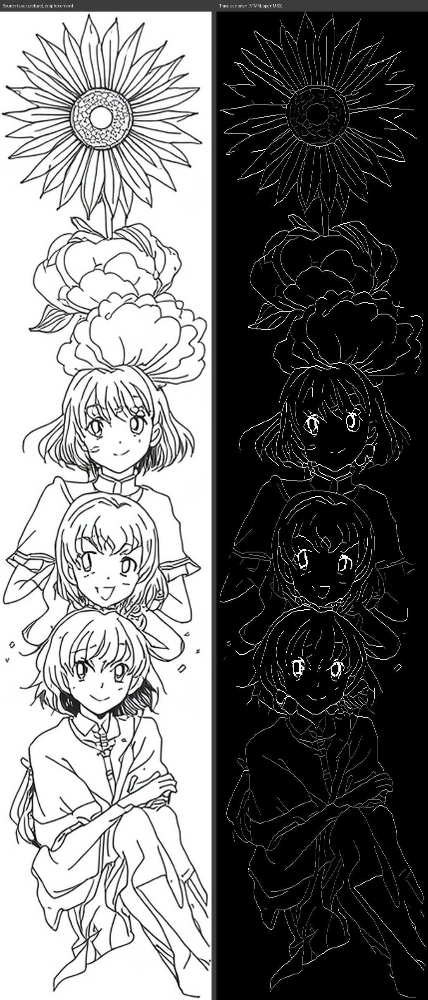
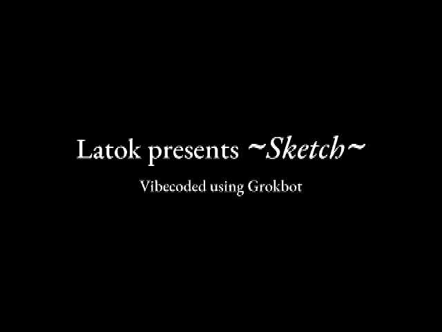

# MSX2 Pencil Sketch (Screen 7)

A pencil-sketch cartridge for MSX2 computers, inspired by the drawing scroll in *Baltak Rampage*. Eight pens draw a line picture at the same time, spread across the screen, while the paper scrolls down. The finished drawing slides out at the bottom and the next one starts. It loops forever.


## What's new in v1.1: "Sunflower column"



- **New picture:** a tall line-art column with a sunflower, peonies and three anime girl portraits, the last one seated and hugging her knees.
- **Power-on intro:** a title card ("Latok presents ~Sketch~") fades in, holds, and fades out before the drawing starts.
- **7 greys on black:** brightest for the outlines of faces, hair and flowers, mid greys for petals, clothing and inner lines, dark greys (down to RGB 2,2,2) for fine detail such as the sunflower centre, hatching and sparkles. The stem interlude between pictures stays grey.
- **Full 512-pixel width:** the engine now supports 9-bit x coordinates, so the picture uses the whole Screen 7 width. The picture is 512×1196 pixels, cropped to the content and scaled without distortion (Screen 7 pixels are twice as tall as wide).
- **Cleaner eyes and smoother lines:** single smoothed strokes with doubled lines merged; eyes are drawn from the source at screen resolution.
- **Timing:** about 108 seconds per pass (1439 scroll lines at 4.5 frames each, 60 Hz); the figure is drawn in about 93 s of each pass. The same 8-pen pace and density limiter as v1.0 are used, with the wrap-safe counter fix.
- **ROM:** `rom/sketch_column_s7.rom`, 256KB, ASCII16 mapper, sha256 `4e01b1b4b9a3d7237ebfa0ec27ad5722a7bcb469752bc94b15ebc8af2a8dd70a`.
- **Testing:** v1.1 is tested in openMSX (C-BIOS MSX2) only: 2 full passes with no dropped frames, no skipped steps, an exact pixel match with the trace and no residue (see `column/verify/verify_v1.1.txt`). It has not been tested on real hardware yet. Earlier builds ran on a real MSX2.

 

## Download

- `rom/sketch_column_s7.rom` (v1.1, Sunflower column): 256KB, ASCII16 mapper.
- `rom/pencil_sketch_s7.rom` (v1.0 framework): 256KB, ASCII16 mapper.

Both are also attached to their GitHub releases.

## Running it

- **Emulator:** `openmsx -machine C-BIOS_MSX2 -cart rom/sketch_column_s7.rom -romtype ASCII16` (or `rom/pencil_sketch_s7.rom` for v1.0)
- **Real hardware:** an MSX2 with a flash cartridge that supports 256KB ASCII16 ROMs (for example Carnivore2 or MegaFlashROM SCC+). v1.0 was tested on a real MSX; v1.1 is emulator-tested only so far.

## How it looks (v1.0)

- Screen 7 (512×212, 16 colours), white lines on black.
- 8 pens, each working in its own lane across the width at a slightly different height.
- Drawing happens in the upper half of the screen, so each finished part stays visible for about 8 seconds before scrolling off.
- About 55.6 seconds per picture at 60 Hz, with no dropped frames.
- Leftover pixels are cleared continuously, so no residue builds up.

## Source (v1.1)

Everything needed to rebuild `rom/sketch_column_s7.rom` byte for byte. Run from the repository root; needs Python 3 with numpy, Pillow, scipy and scikit-image, plus sjasmplus:

```
python3 column/trace_col.py    # source.jpg + params.json -> paths.json (strokes, tones, load budget)
python3 column/gen_col.py      # paths.json -> pic.inc, layout.json (8 pen lanes, banked records)
python3 column/build_col.py    # engine + intro + picture + palette -> column/sketch_column_s7.rom
column/verify/runtest.sh final 3100   # optional: 2-pass openMSX check (writes ~400MB of dumps to column/verify/out)
```

- `column/engine_col.asm`: the Z80 engine for v1.1: tonal pens (palette slots), 9-bit x, wrap-safe counters.
- `column/palette.json`: the 7-grey palette. `column/params.json`: trace settings.
- `column/source.jpg`: the source line drawing. `column/stems_src.inc`: stem interlude strokes.
- `intro/`: the power-on intro (`intro.asm`, data generated by `make_title.py` and `make_intro_data.py`; `make_title.py` needs the EB Garamond fonts, which are not included).
- `column/verify/`: openMSX dump script and checks (residue audit, trace match, pass timing, intro timing).
- `tools/preprocess_screen.py` is shared with v1.0.

## Source (v1.0)

- `src/engine_s7.asm`: Z80 engine (sjasmplus). It handles the scroll interrupt, pen scheduling, line drawing and screen clean-up.
- `src/strokes.inc`: the stroke data for the current picture.
- `tools/`: Python scripts that trace a line drawing into strokes, split them into pen lanes (`gen_spread.py`), and build the ROM (`build_spread.py`).

Built with sjasmplus. The build scripts expect the original project layout, so treat them as a reference.
